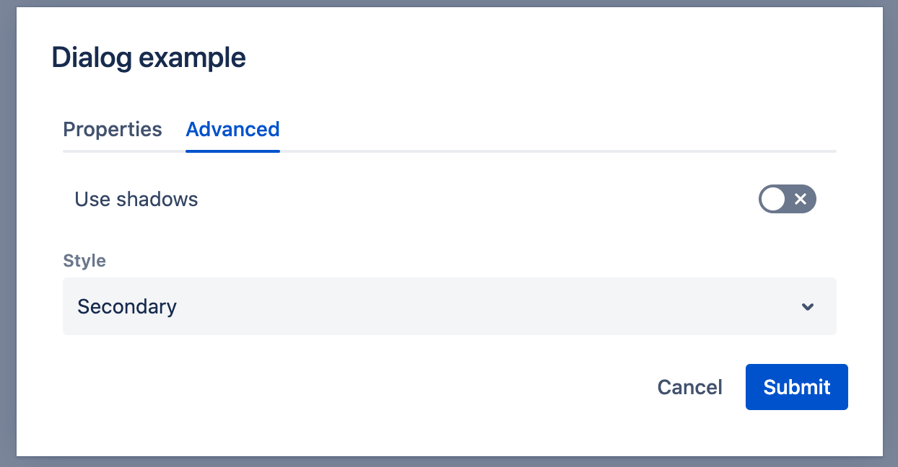

# Dialogs

The Dialogs framework in WebSight CMS allows users to define dialog fields components, which are used to build dialogs. The dialogs can submit data saved in content resources.

WebSight CMS delivers a set of ready-to-use components. See subsections of this documentation for details.

Example dialog structure definition:
```json
{
  "sling:resourceType": "wcm/dialogs/dialog",
  "tabs": {
    "sling:resourceType": "wcm/dialogs/components/tabs",
    "properties": {
      "sling:resourceType": "wcm/dialogs/components/tab",
      "label": "Properties",
      "title": {
        "sling:resourceType": "wcm/dialogs/components/textfield",
        "label": "Title",
        "name": "title"
      },
      "description": {
        "sling:resourceType": "wcm/dialogs/components/richtext",
        "label": "Description",
        "name": "description"
      }
    },
    "advanced": {
      "sling:resourceType": "wcm/dialogs/components/tab",
      "label": "Advanced",
      "shadows": {
        "sling:resourceType": "wcm/dialogs/components/toggle",
        "name": "shadows",
        "label": "Use shadows"
      },
      "style": {
        "sling:resourceType": "wcm/dialogs/components/select",
        "label": "Style",
        "name": "style",
        "primary": {
          "sling:resourceType": "wcm/dialogs/components/select/selectitem",
          "label": "Primary",
          "value": "primary"
        },
        "secondary": {
          "sling:resourceType": "wcm/dialogs/components/select/selectitem",
          "label": "Secondary",
          "selected": true,
          "value": "secondary"
        },
        "link": {
          "sling:resourceType": "wcm/dialogs/components/select/selectitem",
          "label": "Link",
          "value": "link"
        }
      }
    }
  }
}
```

The above will result in following UI dialog: 




Explore available fields and options.
