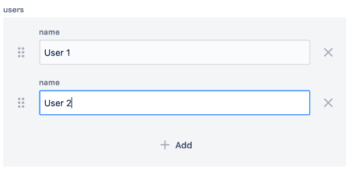

# Multifield

**wcm/dialogs/components/textfield**

## Description

The Multifield component allows user to add, reorder or remove multiple instances of a field.

In simple situations, this can be used ot create simple form input fields (e.g., TextField, TextArea). But it can also function as a complex component that acts as an aggregate of multiple subcomponents (e.g., an address entry).

A field used in multifield behaves the same as in plain dialog; for example, for hiding labels.

## Properties

- **name** - `string` (required)  
    Form field name

- **label** - `string`  
    Display label value

- **required**  
    Indicates if field value is mandatory

## Example

Multifield with TextField:

```json
"users": {
  "sling:resourceType": "wcm/dialogs/components/multifield",
  "name": "users",
  "label": "users",
  "name": {
    "sling:resourceType": "wcm/dialogs/components/textfield",
    "name": "name",
    "label": "name"
  }
}
```



Multifield with nested Multiefield

```json
"users": {
  "sling:resourceType": "wcm/dialogs/components/multifield",
  "name": "users",
  "label": "Users",
  "namefield": {
    "sling:resourceType": "wcm/dialogs/components/textfield",
    "name": "name",
    "label": "Name"
  },
  "addresses": {
    "sling:resourceType": "wcm/dialogs/components/multifield",
    "name": "addresses",
    "label": "Addresses",
    "street": {
      "sling:resourceType": "wcm/dialogs/components/textfield",
      "name": "street",
      "label": "Street"
    }
  }
}
```
