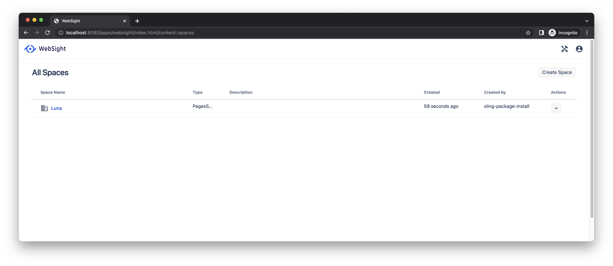
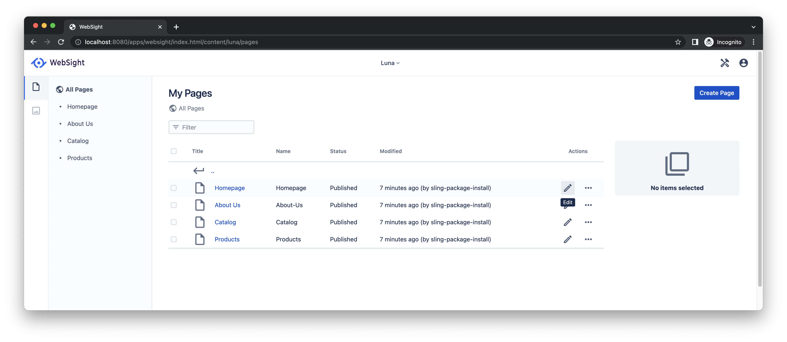
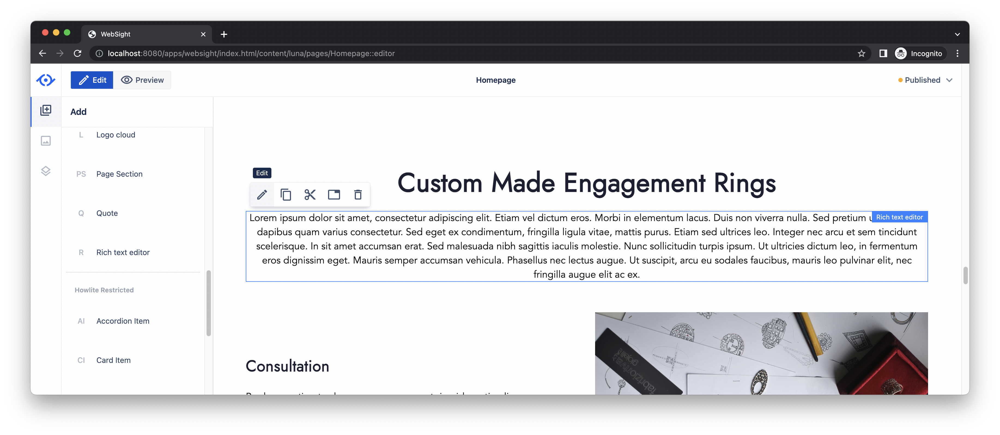
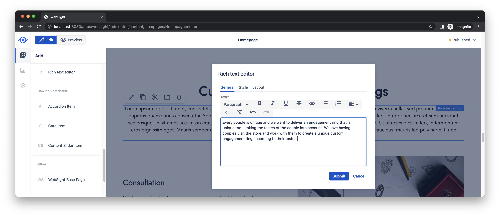

# Quick Start Guide

Follow this guide to quickly run the WebSight local instance using Docker.

## Part A: Run local instance using Docker

!!! info "Prerequisites"

    Before going any further, please make sure you have [Docker Desktop](https://www.docker.com/products/docker-desktop/) installed on your machine and running.

### 1. Join closed WebSight testers group

Currently we are running alpha tests. If you would like to join, please drop us an email. We will contact you and share the WebSight Docker image.

<figure markdown>
  [Ask to join WebSight closed tests group :fontawesome-regular-paper-plane:](#){ .md-button }
</figure>

### 2. Create Docker Compose manifest

Create `docker-compose.yml` file. Paste the content presented below and save the file on your hard drive.

``` yaml title="docker-compose.yml"
version: "3.9"

services:
  ice:
    image: <image-you-will-receive-after-joining-closed-tests-group>
    ports:
      - "8080:8080"
    volumes:
      - websight_repository:/websight/repository
      - websight_html:/websight/docroot
  nginx:
    image: nginx
    ports:
      - "80:80"
    volumes:
      - websight_html:/usr/share/nginx/html:ro

volumes:
  websight_repository:
  websight_html:
```

### 3. Run the local instance

Open the terminal next to the `docker-compose.yml` file and run the following command:

```
docker compose up
```

The fresh WebSight instance will start in a couple of seconds. Now, you may enter [http://localhost:8080/](http://localhost:8080/) to open the WebSight admin panel.
Log in with `admin` username and `admin` as a password.

!!! info "Tip"
  
    To stop the environment use `ctrl + c`. You may run it later exactly the same as it was started for the first time.

---

## Part B: Update a page

Now that your local environment is ready for use, we would like to guide you through basic page amendments. You will update the home page for the demo site delivered together with the WebSight.

### 1. Open the Websight admin panel

The WebSight admin panel runs at [http://localhost:8080/](http://localhost:8080/). Log in with `admin` username and `admin` as a password.

### 2. Select space for the demo site

We use _Spaces_ to organise content. Please open the space for the demo site _Luna_.



### 3. Edit the home page

Open _Actions_ dropdown for home page and select _Edit_. This action runs _Page editor_. 



Scroll down to section _Custom Made Engagement Rings_.

Use drag & drop to place _Rich text editor_ component just below the section title. 


Click on the new component to open available actions. Select pencil icon to edit properties.



Copy & paste the following text on _General_ tab of the modal.

```
Every couple is unique and we want to deliver an engagement ring that is unique too – taking the tastes of the couple into account. We love having couples visit the store and work with them to create a unique custom engagement ring according to their tastes.
```



### 4. Publish changes

You need to publish the changes so they are visible on the site. Open the dropdown in the top right corner and select action _Publish_.


### 5. Check the local instance 

Open the demo site again [http://localhost:8080/](http://localhost:8080/). Your changes should be visible now.

## Next steps

- Working with page editor
- Using layouts to speed up page authoring