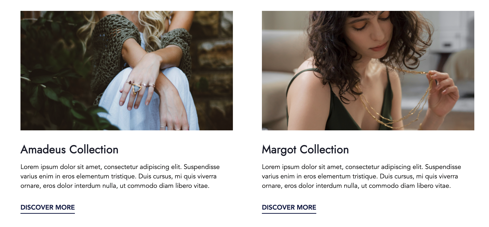
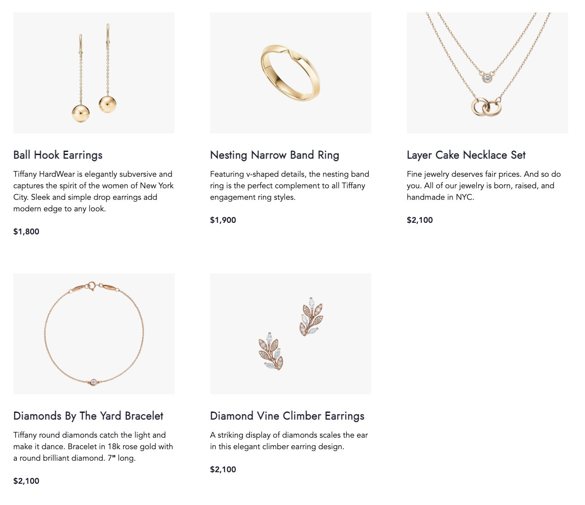

# Cards List & Card Item

## Usage
The Cards List component can be used to add content composed of different elements whose supported layout and behaviour can vary.

Cards may contain a photo, text and a link. A card collection is a layout of cards on the same plane.

To add drag & drop the component to a Page section. By default, Cards List consists of 3 Card Items. 

    

You can change the number of Items inside the List. Drag & drop a Card Item to extend the Cards List.

    

## Authorable properties
Click the "Edit" icon to see all available *Cards List* properties:

- You can check an option **Display as a slider** - the Slider option allows displaying cards in a slider which is fully responsive and supports touch and swipe navigation as well as mouse drag for the desktop. 
- You can select the **Heading level** that is most appropriate from SEO and accessibility perspective (options H1 - H6).
- You can select the **Heading size** to increase or decrease font size.
- You can set Items per row for each breakpoint - S, M, L by increasing/decreasing the number.

    

- You can set the Style for the Cards List using the **Style** tab:

    

- You can resize the Cards List as any other component using the **Layout** tab. (See [grid](../grid) description for details.)

Click the "Edit" icon on *Card's Item* to see its properties:

- On the **General** tab you can add:
    - Title - the Card's Item heading.
    - Content - the text to be displayed in the Card Item.

    

- On the **Image** tab you can add:
    - an Image - you can open the left assets panel and drag&drop an image to the asset section;
    - additionally, you can provide an alternative text (alt) to describe an image. Leave it blank only when the image is purely decorative.

    

- You can add CTA to the Card Item as any other CTA component using the **Card CTA** tab. (See [CTA](https://www.websight.io/guides/authoring/Howlite/cta/) description for details.)

## Rendered component

Cards List with two Items consisting of an image, text and a link:

Cards List with three Items:

Cards List with three Items with text centred-aligned:

