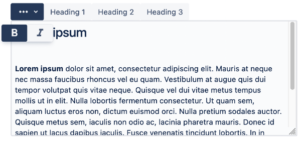

# RichText Editor Configuration

Configuration defines RTE toolbar and functionalities

# Using configuration

RTE provides default configuration at `/apps/wcm/dialogs/components/richtext/configuration`.

Configuration can be referenced by path or defined inline. If inline configuration is defined then referenced configuration is ignored.

Example using default configuration defined by RTE:

```
1<richtext  
2  jcr:primaryType="nt:unstructured"  
3  sling:resourceType="wcm/dialogs/components/richtext"  
4  name="text"/>
```

## Referencing configuration

RTE component allows to define **configuration** string propery. Value is a absolute path to configuration node.

Referencing configuration by path:

```
1<richtext  
2  jcr:primaryType="nt:unstructured"  
3  sling:resourceType="wcm/dialogs/components/richtext"  
4  name="text"  
5  configuration="/apps/myapp/components/common/rte/myconfiguration"/>
```

## Inline configuration

Inline configuration can be definde in dialog under RTE filed in node named `configuration`.

Inline configuration defined by RTE:

```
1<richtext  
2   jcr:primaryType="nt:unstructured"  
3   sling:resourceType="wcm/dialogs/components/richtext"  
4   name="text">  
5   <configuration  
6       jcr:primaryType="nt:unstructured">  
7       <bold  jcr:primaryType="nt:unstructured"  
8           sling:resourceType="wcm/dialogs/components/richtext/ui/button"  
9           title="Bold"  
10          icon="format_bold">  
11          <plugin  jcr:primaryType="nt:unstructured"  
12              sling:resourceType="wcm/dialogs/components/richtext/plugin/bold"/>  
13      </bold>  
14  </configuration>  
15</richtext>
```

## Extending and overriding configuration

Configuration (referenced or inline) can extend other configuration by using `sling:resourceSuperType`, see [Sling Resource Merger](https://sling.apache.org/documentation/bundles/resource-merger.html "https://sling.apache.org/documentation/bundles/resource-merger.html") (/mnt/override) and customize it with options comming from Resource Merger, like `sling:hideChildren`.

```
1<configuration  
2   jcr:primaryType="nt:unstructured"  
3   sling:resourceSuperType="wcm/dialogs/components/richtext/configuration"  4  sling:hideChildren="[italic]">  
5   <bold  jcr:primaryType="nt:unstructured"  
6   sling:resourceType="wcm/dialogs/components/richtext/ui/button"  
7       title="Bold"  
8       icon="format_bold">  
9       <plugin  jcr:primaryType="nt:unstructured"  
10          sling:resourceType="wcm/dialogs/components/richtext/plugin/bold"/>  
11      </bold>  
12</configuration>
```

# Building configuration

Configuration is prepared by two kinds of components:

- UI - components define UI element added to menu bar.

- plugin - components provide functionality

Separation UI and plugin components allows to define toolbar in many variants depending of authors needs. E.g. `bold` action can be added as a separated button or one of buttons grouped in the dropdown, different `headings` can be added in a dropdown list or as a separated buttons.  
There is also possibility to create dedicated UI components and build whole toolbar using just them, or create new plugin and add it to toolbar using existing UI component.

Configuration examples:  
  
----------


```
1<textstyle  
2       jcr:primaryType="nt:unstructured"  
3       sling:resourceType="wcm/dialogs/components/richtext/ui/dropdown"  
4       title="Text Style">  
5   <h1  jcr:primaryType="nt:unstructured"  
6       sling:resourceType="wcm/dialogs/components/richtext/ui/dropdown/dropdownitem"  
7       title="Heading 1">  
8       <plugin  jcr:primaryType="nt:unstructured"  
9           sling:resourceType="wcm/dialogs/components/richtext/plugin/heading"  
10          level="1"/>  
11  </h1>  
12  <h2  jcr:primaryType="nt:unstructured"  
13      sling:resourceType="wcm/dialogs/components/richtext/ui/dropdown/dropdownitem"  
14      title="Heading 2">  
15      <plugin  jcr:primaryType="nt:unstructured"  
16          sling:resourceType="wcm/dialogs/components/richtext/plugin/heading"  
17          level="2"/>  
18  </h2>  
19  <h3  jcr:primaryType="nt:unstructured"  
20      sling:resourceType="wcm/dialogs/components/richtext/ui/dropdown/dropdownitem"  
21      title="Heading 3">  
22      <plugin  jcr:primaryType="nt:unstructured"  
23          sling:resourceType="wcm/dialogs/components/richtext/plugin/heading"  
24          level="3"/>  
25  </h3>  
26  <paragraph  jcr:primaryType="nt:unstructured"  
27      sling:resourceType="wcm/dialogs/components/richtext/ui/dropdown/dropdownitem"  
28      title="Paragraph">  
29      <plugin  jcr:primaryType="nt:unstructured"  
30          sling:resourceType="wcm/dialogs/components/richtext/plugin/paragraph"/>  
31  </paragraph>  
32  </textstyle>  
33<bold  jcr:primaryType="nt:unstructured"  
34      sling:resourceType="wcm/dialogs/components/richtext/ui/button"  
35      title="Bold"  
36      icon="format_bold">  
37      <plugin  jcr:primaryType="nt:unstructured"  
38      sling:resourceType="wcm/dialogs/components/richtext/plugin/bold"/>  39</bold>  
40<italic  jcr:primaryType="nt:unstructured"  
41      sling:resourceType="wcm/dialogs/components/richtext/ui/button"  
42      title="Italic"  
43      icon="format_italic">  
44      <plugin  jcr:primaryType="nt:unstructured"  
45  sling:resourceType="wcm/dialogs/components/richtext/plugin/italic"/>  
46</italic>
```

----------



```

1<textformat  
2       jcr:primaryType="nt:unstructured"  
3       sling:resourceType="wcm/dialogs/components/richtext/ui/buttondropdown"  4  icon="more_horiz"  
5       activable="true"  
6       title="Text Format">  
7   <bold  jcr:primaryType="nt:unstructured"  
8           sling:resourceType="wcm/dialogs/components/richtext/ui/button"  
9           title="Bold"  
10          icon="format_bold">  
11      <plugin  jcr:primaryType="nt:unstructured"  
12              sling:resourceType="wcm/dialogs/components/richtext/plugin/bold"/>  
13  </bold>  
14  <italic  jcr:primaryType="nt:unstructured"  
15          sling:resourceType="wcm/dialogs/components/richtext/ui/button"  
16          title="Italic"  
17          icon="format_italic">  
18      <plugin  jcr:primaryType="nt:unstructured"  
19              sling:resourceType="wcm/dialogs/components/richtext/plugin/italic"/>  
20  </italic>  
21</textformat>  
22<h1  jcr:primaryType="nt:unstructured"  
23      sling:resourceType="wcm/dialogs/components/richtext/ui/button"  
24      title="Heading 1">  
25    <plugin  jcr:primaryType="nt:unstructured"  
26          sling:resourceType="wcm/dialogs/components/richtext/plugin/heading"  
27    level="1"/>  
28</h1>  
29<h2  jcr:primaryType="nt:unstructured"  
30      sling:resourceType="wcm/dialogs/components/richtext/ui/button"  
31      title="Heading 2">  
32  <plugin  jcr:primaryType="nt:unstructured"  
33          sling:resourceType="wcm/dialogs/components/richtext/plugin/heading"  
34  level="2"/>  
35</h2>  
36<h3  jcr:primaryType="nt:unstructured"  
37      sling:resourceType="wcm/dialogs/components/richtext/ui/button"  
38      title="Heading 3">  
39  <plugin  jcr:primaryType="nt:unstructured"  
40          sling:resourceType="wcm/dialogs/components/richtext/plugin/heading"  
41  level="3"/>  42</h3>

```

## Available Components

### Available UI components

- Button
- Button Dropdown
- Dropdown
- Link

### Available plugin components

Available plugin components are described in Plugin Configuration

## Custom Components

There is a possibility to prepare custom components. To do so there is a need to prepare files according to UI or plugin specification. In case of plugin component there is also need to provide TipTap extensions. They can be taken from existing extensions or written by a developer according to TipTap extension interface.
